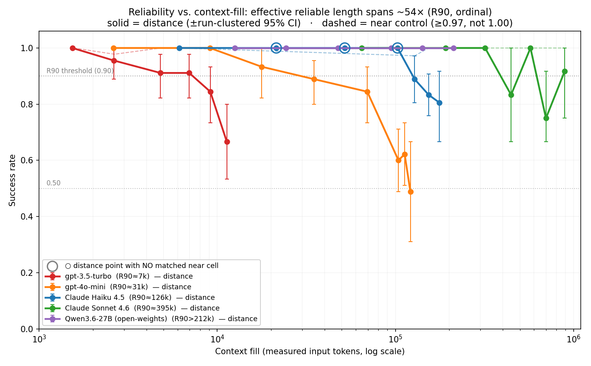

# agent-reliability

**A capability-controlled instrument for measuring agent reliability** — how reliably an LLM retrieves and *uses* information as its context fills, measured **separately from raw capability**.

This is a **methodology contribution, not a leaderboard.** Every figure below reproduces from a clean clone with zero API spend (`python analyze_curves.py && python make_figures.py`).

---

## What this is, and why

Modern LLMs advertise enormous context windows — 200K, even 1M tokens — but the advertised window is **not** the *usable* window: a model gets less reliable at finding and using a specific fact long before it "runs out" of context. This project builds a small, controlled instrument to measure **where that reliability breaks for a given model**, and — the load-bearing part — to measure it **separately from raw capability**, so a failure means *"couldn't reliably retrieve the value under load,"* not *"couldn't do the task at all."*

**The goal** is a clean, honest *method* for measuring reliability-under-context-load — demonstrated across **five models from two providers** (four API models + one open-weights white-box rung), with every number reproducible and every limitation stated plainly. It's a research/portfolio piece aimed at AI-evaluation work; the emphasis is rigour and honesty over a flashy headline. The contribution is narrow and explicit: the matched capability control, a failure-severity taxonomy, and a "reliability is a coordinate system" framing — *not* discovery of the underlying phenomenon, which the long-context literature already established (see [Positioning](#positioning-vs-the-long-context-literature)).

**Status:** complete and self-contained. Five-rung ladder (four API models + an open-weights white-box rung, all figures reproducible offline with no API key), two independent adversarial code-review passes addressed. Genuinely remaining items are flagged as [future work](#future-work): a length-disentangling sweep (`--padding inert`), pushing the open-weights rung past its measured ctx-212k lower bound, and a multi-needle / multi-hop variant — the current results stand on their own without them.

---

## The question

Agent benchmarks usually report one number — a success rate — that quietly fuses two different things:

- **Capability** — *could* the model do this task at all?
- **Reliability** — given that it can, *how dependably* does it as conditions get harder?

For deployment, the second often matters more, and aggregate accuracy hides it. This repo measures reliability with **per-step code-use capability held at ceiling**, sweeping a controlled load variable: **how much distractor-dense context the value must be retrieved through.** (Context length and the number of same-format distractors grow together, so the IV is *retrieval-under-load*, not raw length alone — see [Honest limits](#honest-limits-these-are-part-of-the-contribution).)

## The instrument

The agent must write a one-line function, `factor_<id>(n) = n * <value>`, where `<value>` must be retrieved from a large, cached reference "manual" of `Rule R-<id>: ... is <value>` lines — among **confusable, same-format distractors**. The value must be *used in code*, not echoed. There is **no correctness feedback** (no `run_tests`): the agent gets up to `--max-steps` tool calls and only parse/import errors are echoed back — not whether the value is right.

Two matched conditions over the same task isolate reliability from capability:

| Condition | Where the value lives | What it measures |
|---|---|---|
| **`near`** | restated in the prompt | per-step **capability** (`n*value` when handed the value) |
| **`distance`** | only in the manual | **reliability** (retrieve the right value under context load) |

> **The load-bearing move:** if `near` stays **at/near ceiling** (min **0.97** across the panel) while `distance` decays, the decay *cannot* be "long-context capability relabeled" — the **code-use capability** (writing `factor(n)=n*v` when handed the value) does not decay. To be precise, what's controlled is *per-step code-use*, not general capability. This is still a **tighter** control than the long-context retrieval literature uses: a *matched, same-fill* baseline, rather than 100-LongBench's short-context subtraction or RULER/NIAH's lack of one.

Failures are taxonomised by **severity**: `distractor` (confident mis-retrieval of a real-but-wrong value), `wrong` (fabrication of a value not in the manual), `abstain` (graceful decline). Silent confident errors are the dangerous mode; most benchmarks score all three identically.

## Headline result

With `near` **at/near ceiling the whole way** (min 0.97; flat to **891k tokens on Sonnet**, 89% of a 1M window), the **effective reliable context length — R90, the fill where `distance` first crosses below 0.90 — spans ~54×** across the four API models. A fifth rung — the open-weights **Qwen3.6-27B** — **never failed a single needle anywhere tested** (a flat, perfect 1.00 to ctx ~212k). Read that as the **single-needle task saturating for a strong model**, *not* as Qwen topping the ladder: **you can't rank a model that never failed** against ones that did. So it joins the top band as the white-box / reproducibility anchor with R90 **> 212k** (a lower bound), not as a higher rung. R90 is a **descriptive first-crossing contour** (linear-interpolated), not a fitted parameter: the cross-model **ordering** is robust, the precise value is noise-sensitive (especially Sonnet, which bounces back above 0.90 after its first dip).

| Model | Provider | Window | **R90 (first 0.90-crossing)** | `near` min |
|---|---|---|---|---|
| gpt-3.5-turbo | OpenAI | 16k | **~7.3k** | 0.98 |
| gpt-4o-mini | OpenAI | 128k | **~30.7k** | 1.00 |
| Claude Haiku 4.5 | Anthropic | 200k | **~125.7k** | 0.97 |
| Claude Sonnet 4.6 | Anthropic | 1M | **~395k** | 1.00 (to 891k) |
| Qwen3.6-27B (open-weights) | vLLM (local, BF16) | 262k | **>212k** (flat; lower bound) † | 1.00 (to 212k) |



*Error bars are **run-clustered** 95% bootstrap CIs (`bootstrap_ci.py`), not needle-level — so the plot is no more confident than the analysis. Hollow rings mark distance points with **no matched `near` cell** (3 low-fill Haiku points; a matched-near re-run is a TODO).*

> † **The Qwen row is saturation, not a #1 ranking.** Qwen3.6-27B **never failed a needle** anywhere tested — every cell is 45/45 or 24/24, a flat 1.00 to ctx ~212k. That means the **single-needle task saturated** for a strong model; it is **not** evidence Qwen is the most reliable model on the ladder. You can't rank a model that never failed against ones that did, so it sits in the top band **unranked**, as the reproducible white-box anchor. In `bootstrap_ci.py` its run-clustered CI is a degenerate **[1.00, 1.00]** — the quantitative face of that saturation.

## Reliability is a coordinate system, not a number

The decomposition is the contribution: "model X is better" becomes a structured statement across axes that move independently.

1. **Effective reliable length** (R90 = descriptive first 0.90-crossing; c₅₀ = fitted) — the capability axis. *Cross-model ordering robust; the precise R90 is a noise-sensitive contour, not a fitted/stable parameter.*
2. **Decay steepness** (β) — the reliability axis (cliff vs. graceful). *Real but tail-dependent at this N.*
3. **Failure severity** — confidently-wrong → fabricates → abstains → always-answers, across the ladder. *Interesting, but confounded with depth.*
4. **Needle position** — lost-in-the-middle: at matched fill the **middle** degrades most; edges are near-immune. General across both providers ⇒ **R90 is a middle / worst-case measure.**


## Honest limits (these are part of the contribution)

- **The IV is confounded** — the manual grows by adding more *same-format* distractor rules, and needles are resampled per fill, so context length is entangled with **search-space size** and **target identity**. So the honest IV is **"retrieval under growing distractor-dense load,"** not context length alone. The code ships an `--padding inert` / `--fixed-needle-seed` path that isolates raw length (fixed rule pool + inert filler); running that disentangling sweep is a funded-session **TODO**, not yet done.
- **Small N (5 rungs, only 4 fitted): no cross-model *predictive* law survives** — this is a descriptive coordinate system, not a predictor. The open-weights rung is flat (no in-window knee), so it adds a model but not a fitted point. The geometric "~4.1×/rung" ladder was R²=1.00 on 3 models but predicted Sonnet R90≈523k vs actual 395k (−24%); any 3 monotone points fit a line with R²≥0.75 by construction. Reproduce with `python invariant_power_sim.py`.
- **`near` is at/near ceiling, not 1.00** — run-clustered minima are 0.97 (Haiku) / 0.98 (gpt-3.5); CIs are wide on the few-run Anthropic cells, and a few low-fill Haiku *distance* points have **no matched `near` cell**. The decay is still unambiguous, but "pinned at 1.00" was an overstatement. Reproduce with `python bootstrap_ci.py`.
- **Sonnet doesn't cliff in-window** — its curve is noisy/non-monotonic (3–4 runs/cell, temperature 1.0), so R90≈395k is a noise-sensitive first crossing; only gpt-4o-mini fully crosses 0.50 in-window.
- **Severity labels are heuristic, and the committed numbers use the *old* classifier** — historical `distance` failures are a flat `wrong` (a grab-bag). The code now splits `distractor` (real-but-wrong manual value) / `fabricated` (clean invented number) / `unclassified_wrong` via an AST scan, but that applies to **future** runs only — the modules from past runs are gone, so the severity figures here are not re-graded.
- **One task type** (multiplicative-factor retrieval), a **thin agentic wrapper** (append one function), needles at independence-violating clustering (3 needles share one run → CIs are run-clustered, see `bootstrap_ci.py`), and temperature 1.0. **This is a characterisation, not a formal study** — read the curves as shapes, not precise measurements.

## Positioning vs. the long-context literature

The variable here is context-fill / retrieval-under-load, so the nearest neighbours are the **long-context-retrieval** lit — **RULER, Lost-in-the-Middle (Liu et al. 2023), NIAH, NoLiMa, Chroma "Context Rot", 100-LongBench** — not τ-bench/METR. **Honest scope:** the phenomenon (effective context ≪ advertised) and even the capability-isolation *goal* are precedented; the contribution here is a **tighter control + a severity taxonomy + the coordinate-system frame**, not priority on the phenomenon. Three questions and their answers:

- **"Isn't R90 just RULER's effective context length?"** Same *quantity* — but read against a **per-fill matched capability control** (`near`, at the same fill) rather than RULER's fixed short-context baseline, which rules out the baseline itself being inflated/deflated. Plus an agentic wrapper, a severity taxonomy, and an abstention axis the retrieval benchmarks don't score.
- **"Isn't this 100-LongBench or Chroma's Context Rot?"** Both are close, and both are conceded. 100-LongBench's LongScore *also* separates long-context from base ability — but via a **short-context subtraction**; `near` holds capability at the **same fill**. Chroma shows controlled length-degradation with distractors/position — but keeps the task trivial as an *implicit* control and scores correct/incorrect; we add an **explicit matched control + a failure-severity/abstention taxonomy**.
- **"Why single-needle, not multi-needle?"** Our `distance` task is **NIAH-plus** — confusable same-format distractors + use-in-code — and the proof it isn't "aced" is the result (it spreads the panel 54× and pushes gpt-4o-mini below 0.50). Single-needle is the minimal clean substrate that keeps the capability control airtight; multi-needle / multi-hop is the named next step.

## Run it

```bash
pip install -r requirements.txt
cp .env.example .env        # then fill in ANTHROPIC_API_KEY / OPENAI_API_KEY (gitignored)
```

Reproduce the analysis and figures from the committed data — **no API key or spend needed**:

```bash
python analyze_curves.py        # logistic fits, R90 ladder, collapse test, near minima + CIs
python bootstrap_ci.py          # run-CLUSTERED bootstrap CIs + severity mix (needles aren't independent)
python invariant_power_sim.py   # why N=4 licenses no cross-model law (power simulation)
python make_figures.py          # writes fig1 + fig2 (with Wilson error bars) from the raw JSONL
```

All four read an explicit `data/canonical_manifest.txt` (not a bare glob) and skip any `provider == "mock"` record, so a stray offline/scratch run can't contaminate the real curves.

Validate the harness offline (zero cost), then run a real curve:

```bash
# offline smoke test — every code path, no API calls
python reliability_probe_distance.py --provider mock --mock-mode correct

# a real distance curve (Windows: use `py -3` instead of `python`)
python reliability_probe_distance.py --provider openai --model gpt-4o-mini \
    --conditions near distance --fills 8000 32000 64000 120000 \
    --runs 15 --needles 3 --depth 0.5
```

Key flags: `--provider {anthropic,openai,mock}`, `--model`, `--conditions {near,distance}`, `--fills` (context-fill targets, cap below the model window), `--runs`, `--needles`, `--depth` (needle position; 0.5 = middle = hardest), `--cache` (Anthropic prefix-cache the manual).

## The open-weights rung (Qwen3.6-27B)

The fifth rung is an **open-weights, white-box** point. It adds (a) full reproducibility with **no API key or budget**, and (b) a control where vendor-side context handling (retrieval augmentation, attention sinks, hidden compression) can't confound a "context-fill" reading, because the serving stack is fully known. It runs **Qwen3.6-27B** in dense **BF16** on a single 80 GB A100 via **vLLM**, at the model's **native 262k window (no YaRN)**, thinking off. vLLM's OpenAI-compatible endpoint means the existing OpenAI adapter works with just `OPENAI_BASE_URL` pointed at the local server — no harness change beyond a base-URL swap.

> **Provenance (read this before trusting the config line).** Those serving specifics — *Qwen3.6-27B, BF16, native 262k / no YaRN, A100, thinking-off, `qwen3_coder` parser* — are recorded in the run notebook ([`notebooks/colab_open_model.ipynb`](notebooks/colab_open_model.ipynb)), in [`data/canonical_manifest.txt`](data/canonical_manifest.txt), and in the commit history. They are **not** stored inside the per-record JSONL, which logs only `model="open-model"`, `provider="openai"` (the local vLLM endpoint). So treat the config as **notebook/manifest-attested, not data-attested**: the reliability numbers are reproducible from the committed records; the *identity of the model that produced them* rests on that provenance trail.

**Result:** both `near` and `distance` are a **flat, perfect 1.00 through ctx ~212k** — Qwen **never failed a single needle** in any cell (45/45 and 24/24 throughout). The honest reading is **task saturation, not a #1 ranking**: the model lands in the top band but is **unrankable** against Sonnet (whose knee, ~395k, is beyond Qwen's tested range), so R90 is a **lower bound (>212k)**. `near = 1.00` in BF16 confirms the serving stack (quant / RoPE / tool-parsing) didn't silently degrade retrieval — the `near` control guards the quantization confound. The reason it stopped at ctx ~212k is **reach, not cleanliness**: an A100's KV cache holds ~one max-length sequence, so extending past fill 144k (the next fills, 160–172k → ctx ~235–253k) first stalled on KV-cache concurrency at the default `--workers`, and Colab compute units then ran out before the single-request `--workers 1` retry could run. So ctx ~212k is the deepest *successful* measurement, not the model's limit. The broader point: **single-needle retrieval saturates for strong models** (Sonnet *and* Qwen3.6-27B both at ceiling), which is exactly what makes a multi-needle / multi-hop variant the highest-value next step.

Reproduce on a Colab A100 with [`notebooks/colab_open_model.ipynb`](notebooks/colab_open_model.ipynb): it installs vLLM matched to the runtime CUDA, serves the model with the correct long-context + tool-call configuration, runs a `near`-only smoke test as the go/no-go, then the sweep.

## Future work

- **Multi-needle / multi-hop variant** — the highest-value add. Single-needle retrieval saturates at the top of the ladder (Sonnet *and* Qwen3.6-27B both at ceiling), so a harder retrieval task is the only way left to *separate* strong models; it would also move every top-band knee left.
- **Length-disentangling sweep** (`--padding inert --fixed-needle-seed`) — isolates raw context length from distractor-count and target identity, letting the headline IV move from *"retrieval under growing distractor-dense load"* to *isolated context-length*. The code path ships; the run is pending.
- **Push the open-weights rung past ctx 212k** — re-run the top fills at `--workers 1` (one request at a time, avoiding the KV-cache queue timeout) to turn its R90 lower bound into a located value.
- **A second task type** beyond multiplicative-factor retrieval, to test generality.

## Repo structure

```
reliability_probe_distance.py   # the instrument (near vs distance, context-fill sweep)
reliability_probe.py            # v1: native tool-calling loop (frozen baseline)
reliability_probe_v2.py         # v2: accumulating-context harness (frozen)
analyze_curves.py               # logistic fits + R90 contour + collapse test + near minima (stdlib)
bootstrap_ci.py                 # run-clustered bootstrap CIs + severity breakdown (stdlib)
invariant_power_sim.py          # power simulation for the no-cross-model-law claim (stdlib)
make_figures.py                 # renders fig1 + fig2 (with error bars) from the raw JSONL
data/
  canonical_manifest.txt        # explicit list of canonical run files (anti-contamination)
  dist_results_*.jsonl          # the 5-rung ladder (canonical, depth=0.5); mock -> mock_results_*
  posweep_manifest.txt          # explicit list of the position-sweep files
  posweep_*.jsonl               # needle-position sweeps (lost-in-the-middle)
figures/
  fig1_*.png, fig2_*.png        # the two figures (regenerate with: python make_figures.py)
notebooks/
  colab_open_model.ipynb        # Colab notebook reproducing the open-weights rung
```

## License

MIT — see [LICENSE](LICENSE).
