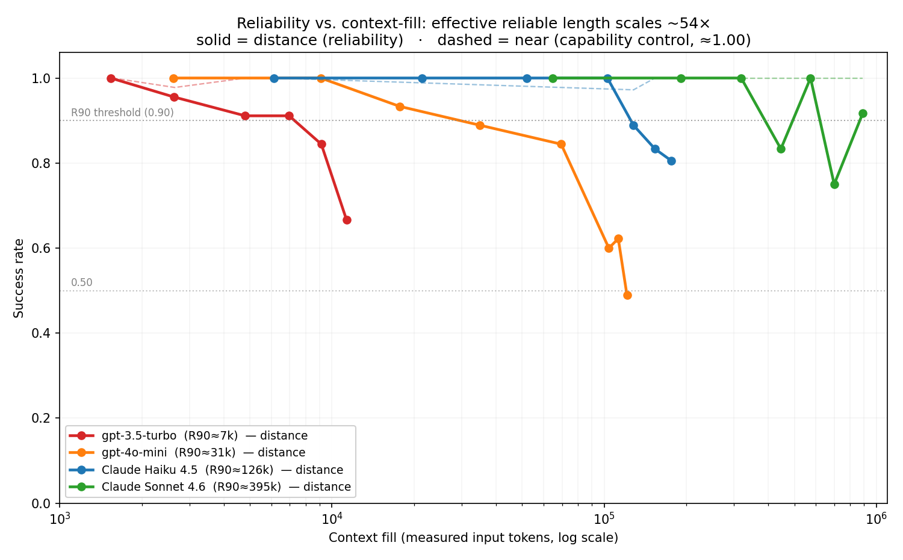
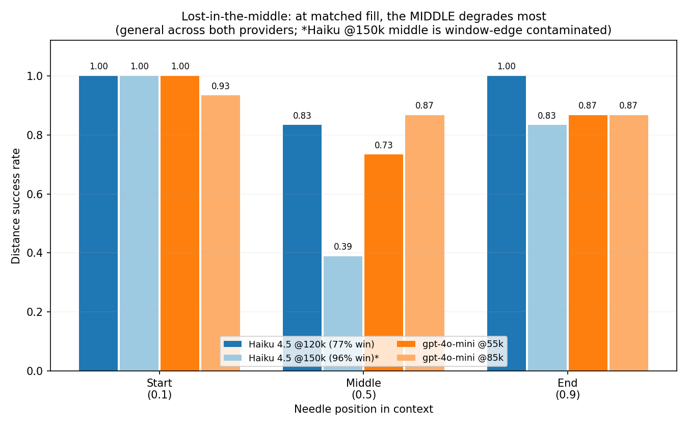

# agent-reliability

**A capability-controlled instrument for measuring agent reliability** — how reliably an LLM retrieves and *uses* information as its context fills, measured **separately from raw capability**.

This is a **methodology contribution, not a leaderboard.** Every figure below reproduces from a clean clone with zero API spend (`python analyze_curves.py && python make_figures.py`).

---

## The question

Agent benchmarks usually report one number — a success rate — that quietly fuses two different things:

- **Capability** — *could* the model do this task at all?
- **Reliability** — given that it can, *how dependably* does it as conditions get harder?

For deployment, the second often matters more, and aggregate accuracy hides it. This repo measures reliability with capability **held constant**, sweeping a single hard variable: **how full the context is**.

## The instrument

The agent must write a one-line function, `factor_<id>(n) = n * <value>`, where `<value>` must be retrieved from a large, cached reference "manual" of `Rule R-<id>: ... is <value>` lines — among **confusable, same-format distractors**. The value must be *used in code*, not echoed. One shot, no test-and-retry crutch.

Two matched conditions over the same task isolate reliability from capability:

| Condition | Where the value lives | What it measures |
|---|---|---|
| **`near`** | restated in the prompt | per-step **capability** (`n*value` when handed the value) |
| **`distance`** | only in the manual | **reliability** (retrieve the right value under context load) |

> **The load-bearing move:** if `near` stays pinned at **1.00** while `distance` decays, the decay *cannot* be "long-context capability relabeled" — capability-with-the-value-provided does not decay. This is the construct-validity control the long-context retrieval literature (RULER, lost-in-the-middle, NIAH) lacks.

Failures are taxonomised by **severity**: `distractor` (confident mis-retrieval of a real-but-wrong value), `wrong` (fabrication of a value not in the manual), `abstain` (graceful decline). Silent confident errors are the dangerous mode; most benchmarks score all three identically.

## Headline result

With `near` pinned at 1.00 the whole way (out to **891k tokens on Sonnet**, 89% of a 1M window), the **effective reliable context length — R90, the fill where `distance` first drops below 0.90 — scales monotonically ~54×** across a 4-model, 2-provider ladder:

| Model | Provider | Window | **R90 (effective reliable length)** | `near` control |
|---|---|---|---|---|
| gpt-3.5-turbo | OpenAI | 16k | **~7.3k** | 1.00 |
| gpt-4o-mini | OpenAI | 128k | **~30.7k** | 1.00 |
| Claude Haiku 4.5 | Anthropic | 200k | **~125.7k** | 1.00 |
| Claude Sonnet 4.6 | Anthropic | 1M | **~395k** | 1.00 (to 891k) |



## Reliability is a coordinate system, not a number

The decomposition is the contribution: "model X is better" becomes a structured statement across axes that move independently.

1. **Effective reliable length** (R90 / c₅₀) — the capability axis. *Solid.*
2. **Decay steepness** (β) — the reliability axis (cliff vs. graceful). *Real but tail-dependent at this N.*
3. **Failure severity** — confidently-wrong → fabricates → abstains → always-answers, across the ladder. *Interesting, but confounded with depth.*
4. **Needle position** — lost-in-the-middle: at matched fill the **middle** degrades most; edges are near-immune. General across both providers ⇒ **R90 is a middle / worst-case measure.**



## Honest limits (these are part of the contribution)

- **N=4: no cross-model *predictive* law survives** — this is a descriptive coordinate system, not a predictor. (A geometric "~4.1×/rung" ladder fit on 3 models was tested out-of-sample on the 4th and broke.) Showing *what N can and can't license* is itself a result.
- **Sonnet doesn't cliff in-window** — its curve is noisy/non-monotonic (small n, temperature 1.0), so R90≈395k is a noise-sensitive first crossing; only gpt-4o-mini fully crosses 0.50 in-window.
- **One task type** (multiplicative-factor retrieval) and a **thin agentic wrapper** (append one function) — defensible as tool-using code-gen under retrieval load, not a rich multi-step agent.
- **This is a characterisation, not a formal study** — modest runs, temperature 1.0, single needle configuration; read the curves as shapes, not precise measurements.

## Positioning vs. the long-context literature

The variable here is context-fill / retrieval-under-load, so the nearest neighbours are **RULER, Lost-in-the-Middle (Liu et al. 2023), NIAH, NoLiMa** — not τ-bench/METR. Two questions and their answers:

- **"Isn't R90 just RULER's effective context length?"** Same *quantity*, measured with a **stronger control** — RULER reads it against a fixed short-context baseline; here it's read against a **per-fill matched capability control** (`near`), which rules out the baseline itself being inflated/deflated. Plus an agentic wrapper, a severity taxonomy, and an abstention axis the retrieval benchmarks don't score.
- **"Why single-needle, not multi-needle?"** Our `distance` task is **NIAH-plus** — confusable same-format distractors + use-in-code — and the proof it isn't "aced" is the result (it spreads the panel 54× and pushes gpt-4o-mini below 0.50). Single-needle is the minimal clean substrate that keeps the capability control airtight; multi-needle / multi-hop is the named next step.

## Run it

```bash
pip install -r requirements.txt
cp .env.example .env        # then fill in ANTHROPIC_API_KEY / OPENAI_API_KEY (gitignored)
```

Reproduce the analysis and figures from the committed data — **no API key or spend needed**:

```bash
python analyze_curves.py        # logistic fits, R90 ladder, collapse test, near control
python make_figures.py          # writes fig1 + fig2 from the raw JSONL
```

Validate the harness offline (zero cost), then run a real curve:

```bash
# offline smoke test — every code path, no API calls
python reliability_probe_distance.py --provider mock --mock-mode correct

# a real distance curve (Windows: use `py -3` instead of `python`)
python reliability_probe_distance.py --provider openai --model gpt-4o-mini \
    --conditions near distance --fills 8000 32000 64000 120000 \
    --runs 15 --needles 3 --depth 0.5
```

Key flags: `--provider {anthropic,openai,mock}`, `--model`, `--conditions {near,distance}`, `--fills` (context-fill targets, cap below the model window), `--runs`, `--needles`, `--depth` (needle position; 0.5 = middle = hardest), `--cache` (Anthropic prefix-cache the manual).

## Open-weights rung on Colab / a GPU box

The panel is currently 2 OpenAI + 2 Anthropic (all API). An **open-weights** rung adds (a) full reproducibility with no API key and (b) a **white-box** point where vendor-side context handling can't confound "context-fill." It serves through vLLM's OpenAI-compatible endpoint, so the existing OpenAI adapter works with just `OPENAI_BASE_URL` pointed at the local server.

See [`notebooks/colab_open_model.ipynb`](notebooks/colab_open_model.ipynb) — it downloads a dense open model (Qwen3), serves it with the correct long-context (YaRN) and tool-call configuration, and runs a `near`-only smoke test as the go/no-go before any full sweep.

## Repo structure

```
reliability_probe_distance.py   # the instrument (near vs distance, context-fill sweep)
reliability_probe.py            # v1: native tool-calling loop (frozen baseline)
reliability_probe_v2.py         # v2: accumulating-context harness (frozen)
analyze_curves.py               # logistic fits + R90 ladder + collapse test (pure stdlib)
make_figures.py                 # renders fig1 + fig2 from the raw JSONL
dist_results_*.jsonl            # the 4-model ladder (canonical, depth=0.5)
posweep_*.jsonl                 # needle-position sweeps (lost-in-the-middle)
fig1_*.png, fig2_*.png          # the two figures
notebooks/                      # Colab notebook for the open-weights rung
```

## License

MIT — see [LICENSE](LICENSE).
